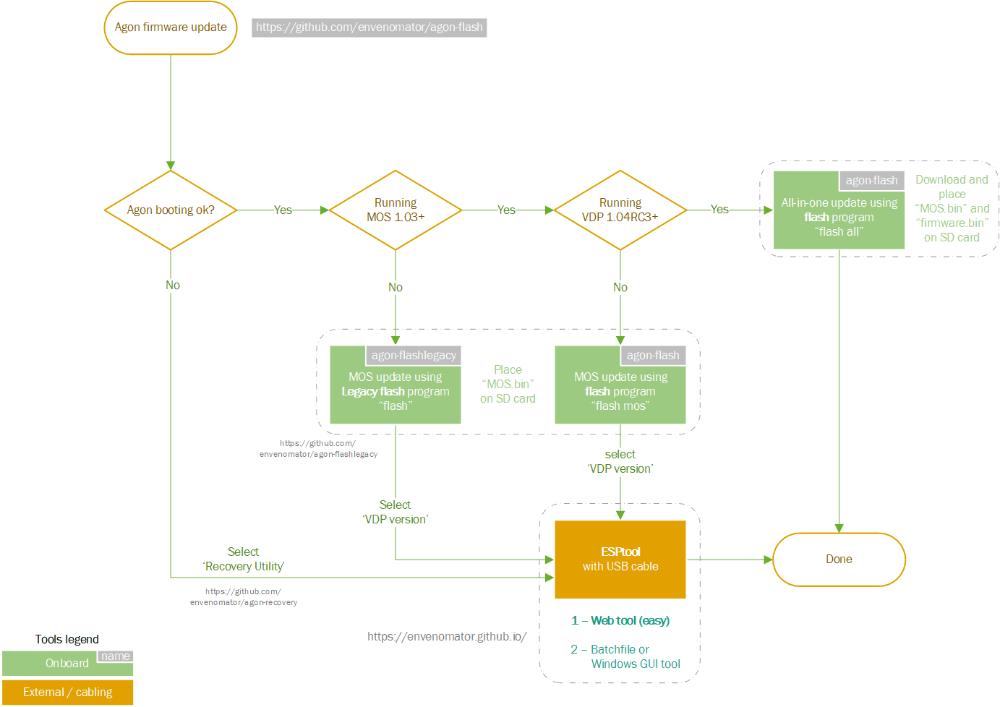

# Agon firmware update utility
The Agon firmware update utility is able to flash MOS / VDP firmware from files on the SD card on any Agon, without using any cables.
## Requirements
The utility needs at least MOS version 1.03. If you are still running an older MOS version, please see this legacy [utility](https://github.com/envenomator/agon-flashlegacy).

Flashing VDP firmware from a file on the SD card, requires a programmed VDP that has OTA (Over-the-air) functionality built in. This is available in Console8 VDP 2.0.0+ and Quark VDP 1.4+ firmware versions. Once a compatible VDP is present in the system, new VDP versions can be flashed using the flash utility. 

This workflow outlines the update process, depending on your specific current MOS/VDP versions:


### Installation
1. Make sure to create a **mos** directory on the microSD card, if it's not already present.
2. Place the [flash.bin](https://github.com/envenomator/agon-flash/blob/master/binaries/flash.bin) in the **mos** directory
3. Place the firmware files in the **root** directory of the microSD card:
- MOS firmware - default filename 'MOS.bin'
- VDP firmware - default filename 'firmware.bin'

## Usage

```console
Usage: FLASH [all | [mos <filename>] [vdp <filename>] | batch] <-f>
```

Using the *all* command tries to flash all firmware, using the default filenames 'MOS.bin' for MOS firmware, 'firmware.bin' for VDP firmware.

Using the *mos* or *vdp* commands, the user can specify a specific type of firmware to flash, optionally using a different firmware filename for each command. Using both *mos* and *vdp* commands without a filename option is similar to the *all* command.

The *batch* command can be used to batch-flash an Agon system using the command in autoexec.txt. In order to facilitate headless flashing, the utility beeps during the flashing sequence (1 for startup, 2 for completing VDP firmware, 3 for completing the MOS firmware) and waits at completion forever.

The *-f* option skips asking the user to verify firmware CRC codes and is set by default using the *batch* command.


### Target firmware versions
Any MOS / VDP version can be flashed.

Precompiled binaries can be found at my [agon-binaries](https://github.com/envenomator/agon-binaries) repository.

Because literally ANY version can be flashed, please be mindful going back to older versions. The Pleistocene may not have a wall-outlet to charge your time travel device.

## Disclaimer
Having subjected my own gear to this utility many hundreds of times, I feel it is safe for general use in upgrading the MOS firmware to a new version.
The responsibility for any issues during and/or after the firmware upgrade, lies with the user of this utility.

## If all else fails
Did you also update your VDP firmware, after updating the MOS? Weird things may happen if both are far apart.

And even then; stuff breaks, things happen. Yeah, wonderful, but what if after whatever happened, you have bricked your AgonLight? Take a deep breath, and have a look at [this](https://github.com/envenomator/agon-vdpflash) utility to perform a *baremetal* recovery.
